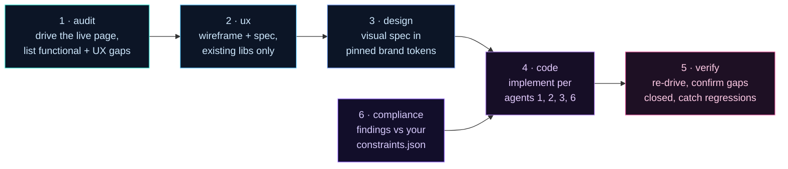

<!-- ░░░░░░░░░░░░░░░░░░░░░░░░░░░░░░░░░░░░░░░░░░░░░░░░░░░░░░░░░░░░░░░░░░░░ -->

<p align="center">
  
</p>

<p align="center">
  <strong>Your AI shipped 32 screens. 18 of them lie.</strong><br>
  Reframe drives every page in a real browser, catches the lies, and opens a PR with the fix.<br>
  Not vibes. A diff you can merge.
</p>

<p align="center">
  
  
  
  
  
</p>

<p align="center">
  <a href="docs/QUICKSTART-VIBE.md"><b>Vibe-coder walkthrough →</b></a> ·
  <a href="#run-it">Run it</a> ·
  <a href="#the-6-agents">The 6 agents</a> ·
  <a href="docs/adr/">ADRs</a>
</p>

---

## What is this

Vibe-coded apps don't fail. They fake-pass.

The build compiles. Tests go green. The customer hits Submit. Nothing happens.

Reframe drives every screen in a real Chromium, audits it through 6 agents, and opens a PR with the fix. A page that silently redirects to login can't fake a green check anymore.

---

## Run it

```bash
npx --yes @resultkitchen/reframe rebuild https://github.com/you/your-app --apply-mode review
```

**What happens when you hit enter:**

1. **0–30 sec** — Maps every page in your repo. Lists routes, DB tables, data calls. Skips API routes.
2. **30 sec–2 min** — Boots your app in a sandbox. Stubs integrations so it can't email customers or charge cards.
3. **2–15 min** — Drives every page in headless Chromium at iPhone / iPad / desktop. Six agents per screen: audit, UX, design, compliance, code, verify.
4. **At the end** — Prints `npx reframe review ./runs/...` Copy-paste it. A local review app opens in your browser.
5. **You triage findings.** Approve, skip, comment in plain English. Per-screen status badges. ~10 min for a 30-screen app.
6. **One more command** — `--apply-mode pr`. The code agent rewrites only what you approved, re-drives the pages to confirm the fix, opens a real PR.

Full walkthrough with screenshots and a per-minute timeline: **[docs/QUICKSTART-VIBE.md](docs/QUICKSTART-VIBE.md)**.

---

## See it

<p align="center">
  
</p>

<p align="center"><sub>Run Overview — every finding across every page, ranked by severity × confidence. A 34-page audit reviewable in 10 minutes.</sub></p>

<p align="center">
  
</p>

<p align="center"><sub>The payoff — a real PR. Plain-English summary on top, technical breakdown below, your review comments embedded in the body.</sub></p>

---

## The 6 agents

Every page gets its own crew. They run as a DAG, not a chat.



Plus a Map stage (Stage 0) before Agent 1, and a Boot gate (Stage 0.5) right after. Every JSON-emitting agent runs through a Zod-validated call path with one retry. That's what catches cross-LLM drift when you swap providers.

---

## Hundreds of small agents, not one big one

A 30-screen app fans out into **6 × 30 = 180 small agent calls.** Each one sees only its page, its job, its contract. No 200k-token monolith holding the whole repo in context.

Why this matters:

- **Higher accuracy.** A small focused prompt with one screenshot and one task beats a giant context with 30 screens fighting for attention. Hallucinations track context size.
- **Lower cost.** 180 small calls cost less than 1 huge one — by an order of magnitude, often two.
- **15-minute refactors, not 15-hour half-done ones.** Parallelism caps runtime at the slowest single page, not the sum of all pages.
- **Cheap to re-run.** A bad finding? Re-fire just that one agent (`--resume`), not the whole repo.

This is why **Gemini is the default.** Gemini Flash runs 3–7× faster than competing SOTA models at a fraction of the price, and at 180-calls-per-run scale that speed/$ compounds. Premium Claude or OpenAI runs work — they're just slower and more expensive at this fan-out. Pick the tradeoff per provider in `config/models.json`.

---

## What's actually in here

| The trap | What Reframe does |
| --- | --- |
| "It compiles" ≠ "it works" | Boots the app, drives every page in real Chromium |
| Hollow green checks | Auth-redirect or error-overlay can never report PASS |
| Code lying about the DB | Broken-contract diff with `file:line` |
| Off-brand AI redesigns | Design agent uses pinned brand tokens only |
| TCPA / HIPAA / FTC misses | Compliance agent against your `constraints.json` |
| "Trust me, I fixed it" | Verify agent re-drives the page after the fix |
| Non-devs can't read a diff | Visual review app where anyone leaves comments |

<details>
<summary><b>Internals — page-health, resume, auth, live-backend safety</b></summary>

- **Honest page-health.** Every drive classified `ok` / `auth-redirect` / `error-overlay` / `http-error` / `navigation-failed`. Unhealthy ≠ PASS.
- **Resumable.** Per-page, per-agent ledger. Crash, Ctrl-C, rate-limit — `--resume` continues.
- **Auth-aware.** `--auth` form-fills a real login in the same browser context.
- **Live-backend safety.** `--real-env` keeps your real `.env.local`. `--read-only` skips destructive clicks.
- **Diff-only mode.** `--diff-only --diff-base origin/main` narrows the audit to changed pages — tractable as a CI gate.

</details>

<details>
<summary><b>More CLI recipes</b></summary>

```bash
# Map only — no agents, no PR
npx reframe bootstrap ./my-app

# Re-run only verify (~30 sec)
npx reframe verify ./runs/my-app-<stamp>

# Per-PR audit — only screens whose source files this branch touched
npx reframe rebuild ./my-app --diff-only --diff-base origin/main

# CI-friendly JSON summary as the LAST stdout line
npx reframe rebuild ./my-app --json-summary | tee run.log

# Cap pages + route to the cheap model tier
npx reframe rebuild https://github.com/acme/todo-saas --max-pages 10 --quick-scan

# Live install — keep real .env.local, skip destructive clicks
npx reframe rebuild ./my-app --real-env
```

**Exit codes:** `0` = every page verified · `1` = a page failed or the run errored.

</details>

<details>
<summary><b>Swap the LLM provider</b></summary>

Set with `--llm-provider`, pin model IDs in `config/models.json`.

| Provider | Sweet spot | ~30-screen app |
| --- | --- | --- |
| **Gemini** *(default)* | fast, cheap, great general runs | **10–15 min** |
| **Claude** | premium visual design + tricky coding | 40–60 min |
| **OpenAI** | drop-in interchangeable | — |
| **OpenAI-compatible** | local Ollama, LM Studio | base URL e.g. `http://localhost:11434/v1` |

Non-Gemini providers auto-cap at concurrency 2 with backoff.

</details>

<details>
<summary><b>CI integration — drop-in PR audit Action</b></summary>

`.github/workflows/reframe-pr-template.yml` is a drop-in GitHub Action. Copy it into the app repo you want audited.

```bash
reframe rebuild "$GITHUB_WORKSPACE" \
  --apply-mode propose \
  --diff-only --diff-base origin/${{ github.base_ref }} \
  --post-findings --quick-scan --max-pages 12 --json-summary
```

Diff-scoped audit, PR comment with top-3 findings, JSON summary for merge/block branching, run artifacts uploaded. Set `GEMINI_API_KEY` as a repo secret.

</details>

---

## Links

- **[Vibe-coder walkthrough](docs/QUICKSTART-VIBE.md)** — minute-by-minute, with screenshots
- **[ADRs](docs/adr/)** — every architectural decision, with rationale
- **[Module API](docs/MODULE-API.md)** — programmatic surface
- **[CHANGELOG](CHANGELOG.md)** — what shipped, when

<p align="center"><b>Ship a rebuilt app, not a guess.</b><br>
<sub>Apache-2.0 · made by <a href="https://github.com/resultkitchen">@resultkitchen</a> · <a href="https://www.npmjs.com/package/@resultkitchen/reframe">npm</a> · <a href="https://github.com/resultkitchen/reframe/issues">issues</a></sub></p>
