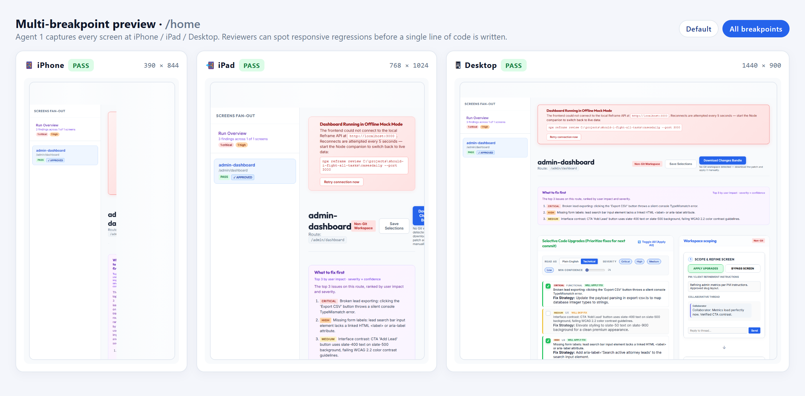
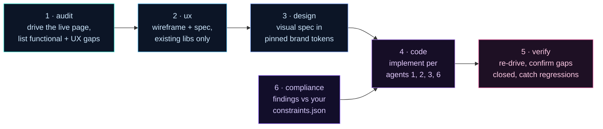

<!-- ░░░░░░░░░░░░░░░░░░░░░░░░░░░░░░░░░░░░░░░░░░░░░░░░░░░░░░░░░░░░░░░░░░░░ -->

<p align="center">
  
</p>

<p align="center">
  <strong>Your AI shipped 32 screens. 18 of them lie.</strong><br>
  Reframe drives every page in a real browser, catches the lies, and hands you a Pull Request that fixes them.<br>
  Not vibes. A diff you can merge.
</p>

<p align="center">
  
  
  
  
  
  
</p>

<p align="center">
  <a href="docs/QUICKSTART-VIBE.md"><b>Vibe-coder walkthrough →</b></a> ·
  <a href="#quickstart">Quickstart</a> ·
  <a href="#the-6-agents">The 6 agents</a> ·
  <a href="#under-the-hood">Internals</a> ·
  <a href="docs/adr/">ADRs</a>
</p>

---

## TL;DR

Vibe-coded apps don't fail. They fake-pass.

The build compiles. Tests go green. Then your customer hits `/leads/new` and the Submit button does nothing, the disclaimer is missing, and a column the code is reading got dropped two weeks ago. You don't know any of this until they tell you.

**Reframe reads every screen with a real browser, audits it through 6 agents, and opens a PR with the fix.** A page that silently redirects to login can't fake a green check anymore.

```bash
npx --yes @resultkitchen/reframe rebuild https://github.com/you/your-app --apply-mode review
```

---

## See it

<p align="center">
  
</p>

<p align="center">
  
  &nbsp;
  
</p>

<p align="center">
  
  &nbsp;
  
</p>

<p align="center"><sub>Walkthrough with all 7 screenshots and step-by-step commands: <a href="docs/QUICKSTART-VIBE.md"><b>docs/QUICKSTART-VIBE.md</b></a></sub></p>

---

## Why this exists

Everyone is racing to generate more code. Almost no one is verifying it.

That's the trap. AI coding agents are great at *writing* apps and terrible at *telling you the truth* about them. They report success the moment the file saves. They don't know if the page renders. They don't know if the button is wired. They don't know that `submissions.user_id` got renamed last week.

The result: 32 screens you can't trust. Every demo is a coin flip.

| What's actually broken | What Reframe does about it |
| --- | --- |
| "It compiles" ≠ "it works" | Boots the app and drives every page in a real Chromium |
| Hollow green checks | Auth-redirect or error-overlay can never report PASS |
| Code that lies about the DB | Broken-contract diff: orphaned tables, missing columns, type drift — with `file:line` |
| Off-brand AI redesigns | Design agent uses your pinned brand tokens only. No invented colors |
| TCPA / HIPAA / FTC landmines | Dedicated compliance agent against your own `constraints.json` |
| "Trust me, I fixed it" | Verify agent re-drives the page and confirms the gap is closed |
| Non-devs can't read a diff | Visual review app where anyone leaves comments that ship into the PR |

The scarce thing isn't code anymore. It's truth. Reframe is a truth engine that happens to write code.

---

## Quickstart

> Node 20+. `npm install` pulls a Playwright Chromium it drives headlessly.

**1.** Install + init against your project:

```bash
npx --yes @resultkitchen/reframe init ./my-app
```

Drops three configs into your repo: `config/brand.json`, `config/auth.json`, `config/constraints.json`. Set a model key in `.env.local` (`GEMINI_API_KEY`, `ANTHROPIC_API_KEY`, or `OPENAI_API_KEY`).

**2.** Run a review pass (no code written yet):

```bash
npx reframe rebuild ./my-app --apply-mode review --auth config/auth.json
npx reframe review ./runs/my-app-<stamp>
```

Opens the visual review app. Approve / skip / comment per finding.

**3.** Apply only what you approved:

```bash
npx reframe rebuild ./my-app --resume runs/my-app-<stamp> --apply-mode pr
```

Rewrites only the approved blocks, re-drives the pages to confirm, opens a PR with the full human conversation embedded.

The full vibe-coder walkthrough with screenshots: **[docs/QUICKSTART-VIBE.md](docs/QUICKSTART-VIBE.md)**.

---

## The 6 agents

Every page gets its own crew. They run as a DAG, not a chat.



| # | Agent | What it actually does |
| --- | --- | --- |
| **0** | Map | Lists pages, routes, DB tables, data calls. Diffs code against schema → broken contracts |
| **0.5** | Boot | Installs deps, runs the dev server, stubs external integrations |
| **1** | Audit | Drives the live page at 3 viewports. Four personas: QA, UX, a11y, brand-voice |
| **2** | UX | Wireframe + spec, restricted to libraries already in your repo |
| **3** | Design | Visual spec in pinned brand tokens. No invented colors |
| **6** | Compliance | Domain/legal findings against your `constraints.json` |
| **4** | Code | Implements the page per agents 1, 2, 3, 6 |
| **5** | Verify | Re-drives the page, confirms gaps closed, catches regressions |

Every JSON-emitting agent runs through a **Zod-validated** call path with one retry on validation failure. That's what catches cross-LLM drift when you swap providers.

---

## Under the hood

The parts that make it trustworthy instead of a toy:

- **Honest page-health.** Every drive is classified `ok` / `auth-redirect` / `error-overlay` / `http-error` / `navigation-failed` from the actual nav response. A page that isn't `ok` cannot pass.
- **Resumable by checkpoint.** `RunState` ledger records per-page, per-agent status after every step. Crash, Ctrl-C, rate-limit — `--resume` continues.
- **Auth-aware.** `--auth` form-fills a real login in the same browser context (real keystrokes, not value-injection). Gated routes get audited logged in.
- **Live-backend safety.** `--real-env` keeps the target's real `.env.local`. `--read-only` skips destructive clicks (delete / send / pay / submit). Point at production-adjacent installs without firing mutations.
- **Broken-contract detection.** Code-vs-schema diffing catches `missing-table`, `missing-column`, `dead-path`, `type-drift`, `orphaned-feature` with `file:line`.
- **Per-PR diff-only mode.** `--diff-only --diff-base origin/main` narrows the audit pool to pages whose source changed on the branch. Makes Reframe tractable as a CI gate on big repos.
- **Bootstrap brand inference.** Static extraction from `tailwind.config.*`, CSS custom properties, shadcn-ui `components.json`. No sandboxed user-code execution.
- **Windows-hardened.** Unique-per-run scratch paths, atomic state writes with retry. EPERM file-lock failures eliminated.
- **No-dep concurrency pool.** N workers pull from a shared queue. One page throwing doesn't abort the pool. Scratch is always torn down in a `finally`.

<details>
<summary><b>More CLI recipes</b></summary>

```bash
# Bootstrap: map the app, derive a brand candidate, exit — no agents, no PR
npx reframe bootstrap ./my-app

# Pin a bootstrapped brand without the interactive prompt (CI / shell scripts)
npx reframe pin ./runs/my-app-<stamp>

# Inspect a previously-bootstrapped brand without firing up the review SPA
npx reframe show-brand ./runs/my-app-<stamp>

# Re-run only Agent 5 — fix by hand, verify in ~30s without full pipeline
npx reframe verify ./runs/my-app-<stamp>

# Per-PR audit: only screens whose source files this branch touches
npx reframe rebuild ./my-app --diff-only --diff-base origin/main

# Notify reviewers via a PR conversation comment (GitHub doesn't notify on body edits)
npx reframe rebuild ./my-app --apply-mode pr --post-findings

# CI-friendly: single-line JSON summary as the LAST stdout line
npx reframe rebuild ./my-app --json-summary | tee run.log

# Cap pages + route review agents to the cheap model tier
npx reframe rebuild https://github.com/acme/todo-saas --max-pages 10 --quick-scan

# Drive dynamic routes with sample params
npx reframe rebuild ./my-app --params '{ "id": "1", "slug": "demo" }'

# Point at a LIVE install: keep real .env.local, skip destructive clicks
npx reframe rebuild ./my-app --real-env   # implies --read-only

# Resume an interrupted run
npx reframe rebuild ./my-app --resume runs/my-app-<stamp>
```

**Exit codes:** `0` = every processed page passed verification · `1` = a page failed or the run errored.
</details>

<details>
<summary><b>Swap the LLM provider</b></summary>

Pick your tradeoff. Set with `--llm-provider`, pin model IDs in `config/models.json`.

| Provider | Sweet spot | Concurrency | ~30-screen app |
| --- | --- | --- | --- |
| **Gemini** *(default)* | fast, cheap, great general runs | `8+` | **10–15 min** |
| **Claude** | premium visual design + tricky coding | `2` *(rate limits)* | 40–60 min |
| **OpenAI** | drop-in interchangeable | tuned per tier | — |
| **OpenAI-compatible** | local — Ollama, LM Studio | local | base URL e.g. `http://localhost:11434/v1` |

Non-Gemini providers auto-cap at `concurrency: 2` with backoff so you don't get throttled.
</details>

<details>
<summary><b>CI integration — drop-in PR audit Action</b></summary>

`.github/workflows/reframe-pr-template.yml` is a drop-in GitHub Action you copy into the app repo you want audited (not into this repo — Reframe doesn't audit itself).

```bash
reframe rebuild "$GITHUB_WORKSPACE" \
  --apply-mode propose \
  --diff-only --diff-base origin/${{ github.base_ref }} \
  --post-findings --quick-scan --max-pages 12 --json-summary
```

What you get: diff-scoped audit, a PR comment with top-3 findings ranked by impact, a JSON summary on stdout for merge/block branching, and run artifacts uploaded (14-day retention). Set `GEMINI_API_KEY` (or your provider key) as a repo secret.
</details>

---

## Links

- **[Vibe-coder walkthrough](docs/QUICKSTART-VIBE.md)** — full step-by-step with screenshots
- **[ADRs](docs/adr/)** — every architectural decision, with rationale
- **[Module API](docs/MODULE-API.md)** — programmatic surface for embedding Reframe
- **[Brand spec](docs/BRAND_SPEC.md)** — how the brand pin gate works
- **[CHANGELOG](CHANGELOG.md)** — what shipped, when

---

<p align="center">
  
</p>

<p align="center"><b>Ship a rebuilt app, not a guess.</b><br>
<sub>Apache-2.0 · made by <a href="https://github.com/resultkitchen">@resultkitchen</a> · <a href="https://www.npmjs.com/package/@resultkitchen/reframe">npm</a> · <a href="https://github.com/resultkitchen/reframe/issues">issues</a></sub></p>
