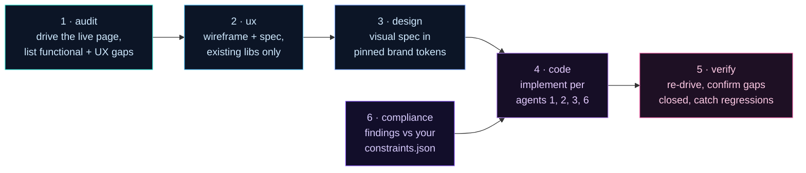

<!-- ░░░░░░░░░░░░░░░░░░░░░░░░░░░░░░░░░░░░░░░░░░░░░░░░░░░░░░░░░░░░░░░░░░░░ -->

<p align="center">
  
</p>

<p align="center">
  <strong>Your AI shipped 32 screens. 18 of them lie.</strong><br>
  Reframe drives every page in a real browser, catches the lies, and opens a PR with the fix.<br>
  Not vibes. A diff you can merge.
</p>

<p align="center">
  
  
  
  
  
</p>

<p align="center">
  <a href="docs/QUICKSTART-VIBE.md"><b>Vibe-coder walkthrough →</b></a> ·
  <a href="#run-it">Run it</a> ·
  <a href="#the-6-agents">The 6 agents</a> ·
  <a href="docs/adr/">ADRs</a>
</p>

---

## What is this

Vibe-coded apps don't fail. They fake-pass.

The build compiles. Tests go green. The customer hits Submit. Nothing happens.

Reframe drives every screen in a real Chromium, audits it through 6 agents, and opens a PR with the fix. A page that silently redirects to login can't fake a green check anymore.

---

## Run it

```bash
npx --yes @resultkitchen/reframe rebuild https://github.com/you/your-app --apply-mode review
```

**What happens when you hit enter:**

1. **0–30 sec** — Maps every page in your repo. Lists routes, DB tables, data calls. Skips API routes.
2. **30 sec–2 min** — Boots your app in a sandbox. Stubs integrations so it can't email customers or charge cards.
3. **2–15 min** — Drives every page in headless Chromium at iPhone / iPad / desktop. Six agents per screen: audit, UX, design, compliance, code, verify.
4. **At the end** — Prints `npx reframe review ./runs/...` Copy-paste it. A local review app opens in your browser.
5. **You triage findings.** Approve, skip, comment in plain English. Per-screen status badges. ~10 min for a 30-screen app.
6. **One more command** — `--apply-mode pr`. The code agent rewrites only what you approved, re-drives the pages to confirm the fix, opens a real PR.

Full walkthrough with screenshots and a per-minute timeline: **[docs/QUICKSTART-VIBE.md](docs/QUICKSTART-VIBE.md)**.

---

## 🚦 Pick your onboarding path

Two ways in. Same destination — a reviewed PR. Click the one that sounds like you.

<details>
<summary><b>🌱 I vibe-coded my app and just want it audited (stupid-simple path)</b></summary>

<br>

**You don't need to know what an API or a CLI is. Follow these in order. Total time: ~25 minutes including installs.**

### Step 1 — Install Node.js (one-time, ~3 min)

Reframe runs on Node 20+. If you've never installed Node, do this:

1. Go to **https://nodejs.org** → click the big green **"LTS"** button. That downloads an installer.
2. Open the installer. Click Next → Next → Install. Accept all defaults.
3. Open a fresh terminal:
   - **Windows:** Press `Win`, type `powershell`, hit Enter.
   - **Mac:** Press `Cmd+Space`, type `terminal`, hit Enter.
4. Type `node -v` and hit Enter. You should see `v20.x.x` or higher. If not, restart your computer and try again.

> If you see `'node' is not recognized` — Node didn't get added to your PATH. Reinstall and make sure the "Add to PATH" checkbox stays checked.

### Step 2 — Get a Google Gemini API key (one-time, ~2 min, free tier)

Gemini is the default because it's fast, cheap, and the free tier is generous enough for most audits.

1. Go to **https://aistudio.google.com/apikey** and sign in with any Google account.
2. Click **"Create API key"** → pick "Create API key in new project" if asked.
3. Copy the key (it looks like `AIzaSyA...`). Treat it like a password — don't share it, don't commit it.

> **Will I get charged?** Gemini's free tier (15 requests/minute, 1M tokens/day) covers ~30-screen audits comfortably. You only get billed if you upgrade to paid. We never auto-upgrade you.

### Step 3 — Put the key where Reframe can find it

In the folder of the app you want audited, create a file called `.env.local` (with the leading dot). Put this one line in it:

```
GEMINI_API_KEY=AIzaSyA...your-key-here
```

Save. That's it. Don't commit this file — `reframe init` will gitignore it for you in step 4.

### Step 4 — Run Reframe

In your terminal, `cd` into your app folder (or paste the path after `cd `, then drag the folder onto the terminal window — that auto-fills the path). Then:

```bash
npx --yes @resultkitchen/reframe init .
npx reframe rebuild . --apply-mode review
```

The first command scaffolds three config files (`brand.json`, `auth.json`, `constraints.json`). The second one starts the audit. Walk away — it takes 10–15 min for a typical 30-screen app.

<p align="center">
  
</p>

### Step 5 — Review the findings in your browser

When the run finishes, the terminal prints a command like `npx reframe review ./runs/my-app-20260529-xxxx`. Copy-paste it, hit Enter. Your browser opens to a local review app.

<p align="center">
  
</p>

Flip the **Vibe / Technical** toggle in the top bar to read findings in plain English. For each one:
- **Approve** — Reframe will rewrite the code
- **Skip** — leave it alone
- **Comment** — type plain English like "make this button royal-blue"

Per-screen badges show your progress. ~10 min for a 30-screen app.

### Step 6 — Open the PR

```bash
npx reframe rebuild . --resume runs/my-app-<stamp> --apply-mode pr --post-findings
```

That rewrites only what you approved, re-drives the pages to confirm the fix didn't break anything, and opens a real GitHub PR. Done.

---

### ❓ "But what if…" — the vibe-coder FAQ

**…it times out or my terminal goes to sleep?**
Nothing is lost. Reframe writes its progress to disk after every page. Re-run the same command with `--resume runs/<your-run-dir>` and it picks up exactly where it stopped. You can Ctrl-C anytime.

**…I hit a rate limit ("429" or "quota exceeded")?**
You're firing the free tier too fast. Re-run with `--max-pages 10` (audits 10 pages, not 30) or add `--concurrency 2` to slow the parallel fan-out. Free tier resets every minute.

**…the run says "boot failed"?**
Your app needs an env var Reframe stubbed out. Re-run with `--real-env` — that passes your real `.env.local` through to the sandboxed app. Safer alternative: open `runs/<stamp>/boot.json` to see which var is missing, add it, retry.

**…how much will this cost me?**
Gemini free tier: $0 for most runs. If you blow past the free tier and want bigger, paid Gemini Flash is roughly **$0.05–$0.20 per 30-screen audit**. Claude/OpenAI runs cost 10–50× more but produce premium visual design fixes.

**…I don't have a GitHub repo, just a local folder?**
Skip `--apply-mode pr`. Use `--apply-mode propose` instead — Reframe writes the fixes as a local diff you can apply by hand with `git apply` or paste into Cursor/Claude Code.

**…the review app won't open / shows a blank page?**
Check the terminal for an error. Most common: port 3737 is in use. Run with `--review-port 4747` to pick another port.

**…I want to stop a run mid-way?**
Press `Ctrl-C` in the terminal. State is saved. Resume with `--resume runs/<stamp>` anytime.

</details>

<details>
<summary><b>⚡ I'm a senior dev, give me the levers</b></summary>

<br>

You probably already have Node 20+ and a provider key. Here's the full surface.

### Install + first run

```bash
# One-shot, no install:
npx --yes @resultkitchen/reframe rebuild ./my-app --apply-mode review

# Or install globally for repeated use:
npm i -g @resultkitchen/reframe
reframe init ./my-app
reframe rebuild ./my-app --apply-mode review --auth config/auth.json
```

### Provider matrix

Set `GEMINI_API_KEY` / `ANTHROPIC_API_KEY` / `OPENAI_API_KEY` (or all three) in `.env.local`. Swap with `--llm-provider gemini|claude|openai|openai-compatible`. Per-stage model overrides live in `config/models.json`:

```jsonc
{
  "gemini":   { "audit": "gemini-2.5-flash", "design": "gemini-2.5-pro", "code": "gemini-2.5-pro" },
  "claude":   { "audit": "claude-sonnet-4-6", "design": "claude-opus-4-7", "code": "claude-opus-4-7" },
  "openai":   { "audit": "gpt-4.1-mini", "design": "gpt-4.1", "code": "gpt-4.1" }
}
```

Non-Gemini providers auto-cap at `--concurrency 2` with exponential backoff.

### Useful flags

| Flag | Effect |
| --- | --- |
| `--apply-mode review \| propose \| pr` | Stop at review / write diff / open PR |
| `--diff-only --diff-base origin/main` | Audit only screens whose source files changed |
| `--resume runs/<stamp>` | Continue an interrupted run; per-page ledger means zero duplicate calls |
| `--max-pages 12 --quick-scan` | Cap pages + route to the cheap-tier model |
| `--auth config/auth.json` | Form-fill a real test login in the same browser context |
| `--real-env` | Skip env stubbing; use your real `.env.local` |
| `--read-only` | Skip destructive clicks (submits, deletes, payments) |
| `--concurrency 6` | Parallel agent calls (Gemini default 6, others 2) |
| `--json-summary` | Last stdout line = machine-readable summary for CI |
| `--post-findings` | After PR open, post top-3 findings as a PR conversation comment |
| `--resume-stage audit \| ux \| design \| code \| verify` | Re-fire one stage across all pages |

### CI gate

`.github/workflows/reframe-pr-template.yml` is drop-in. Set `GEMINI_API_KEY` as a repo secret, then:

```yaml
- run: npx --yes @resultkitchen/reframe rebuild "$GITHUB_WORKSPACE" \
    --apply-mode propose \
    --diff-only --diff-base origin/${{ github.base_ref }} \
    --post-findings --quick-scan --max-pages 12 --json-summary
```

Exit `0` = clean, `1` = failure — wire into branch protection.

### Programmatic embedding

```ts
import { rebuild, verify } from '@resultkitchen/reframe';

const result = await rebuild({
  target: './my-app',
  applyMode: 'review',
  llmProvider: 'gemini',
  maxPages: 20,
  onPageComplete: (page) => console.log(page.slug, page.status),
});
```

Full surface in [`docs/MODULE-API.md`](docs/MODULE-API.md). Brand pin / static extraction story in [`docs/BRAND_SPEC.md`](docs/BRAND_SPEC.md). All architectural decisions in [`docs/adr/`](docs/adr/).

### Debugging

- `runs/<stamp>/manifest.json` — per-page status, agent timings, retry counts
- `runs/<stamp>/boot.json` — boot-gate diagnostics (env vars, port, startup error)
- `runs/<stamp>/scope.json` — what the mapper found
- `runs/<stamp>/<slug>/agent-<n>.json` — raw LLM input + output per agent per page
- `DEBUG=reframe:* reframe rebuild ...` — verbose trace logs to stderr

</details>

---

## See it

<p align="center">
  
</p>

<p align="center"><sub>Run Overview — every finding across every page, ranked by severity × confidence. A 34-page audit reviewable in 10 minutes.</sub></p>

<p align="center">
  
</p>

<p align="center"><sub>The payoff — a real PR. Plain-English summary on top, technical breakdown below, your review comments embedded in the body.</sub></p>

---

## The 6 agents

Every page gets its own crew. They run as a DAG, not a chat.



Plus a Map stage (Stage 0) before Agent 1, and a Boot gate (Stage 0.5) right after. Every JSON-emitting agent runs through a Zod-validated call path with one retry. That's what catches cross-LLM drift when you swap providers.

---

## Hundreds of small agents, not one big one

A 30-screen app fans out into **6 × 30 = 180 small agent calls.** Each one sees only its page, its job, its contract. No 200k-token monolith holding the whole repo in context.

Why this matters:

- **Higher accuracy.** A small focused prompt with one screenshot and one task beats a giant context with 30 screens fighting for attention. Hallucinations track context size.
- **Lower cost.** 180 small calls cost less than 1 huge one — by an order of magnitude, often two.
- **15-minute refactors, not 15-hour half-done ones.** Parallelism caps runtime at the slowest single page, not the sum of all pages.
- **Cheap to re-run.** A bad finding? Re-fire just that one agent (`--resume`), not the whole repo.

This is why **Gemini is the default.** Gemini Flash runs 3–7× faster than competing SOTA models at a fraction of the price, and at 180-calls-per-run scale that speed/$ compounds. Premium Claude or OpenAI runs work — they're just slower and more expensive at this fan-out. Pick the tradeoff per provider in `config/models.json`.

---

## What's actually in here

| The trap | What Reframe does |
| --- | --- |
| "It compiles" ≠ "it works" | Boots the app, drives every page in real Chromium |
| Hollow green checks | Auth-redirect or error-overlay can never report PASS |
| Code lying about the DB | Broken-contract diff with `file:line` |
| Off-brand AI redesigns | Design agent uses pinned brand tokens only |
| TCPA / HIPAA / FTC misses | Compliance agent against your `constraints.json` |
| "Trust me, I fixed it" | Verify agent re-drives the page after the fix |
| Non-devs can't read a diff | Visual review app where anyone leaves comments |

<details>
<summary><b>Internals — page-health, resume, auth, live-backend safety</b></summary>

- **Honest page-health.** Every drive classified `ok` / `auth-redirect` / `error-overlay` / `http-error` / `navigation-failed`. Unhealthy ≠ PASS.
- **Resumable.** Per-page, per-agent ledger. Crash, Ctrl-C, rate-limit — `--resume` continues.
- **Auth-aware.** `--auth` form-fills a real login in the same browser context.
- **Live-backend safety.** `--real-env` keeps your real `.env.local`. `--read-only` skips destructive clicks.
- **Diff-only mode.** `--diff-only --diff-base origin/main` narrows the audit to changed pages — tractable as a CI gate.

</details>

<details>
<summary><b>More CLI recipes</b></summary>

```bash
# Map only — no agents, no PR
npx reframe bootstrap ./my-app

# Re-run only verify (~30 sec)
npx reframe verify ./runs/my-app-<stamp>

# Per-PR audit — only screens whose source files this branch touched
npx reframe rebuild ./my-app --diff-only --diff-base origin/main

# CI-friendly JSON summary as the LAST stdout line
npx reframe rebuild ./my-app --json-summary | tee run.log

# Cap pages + route to the cheap model tier
npx reframe rebuild https://github.com/acme/todo-saas --max-pages 10 --quick-scan

# Live install — keep real .env.local, skip destructive clicks
npx reframe rebuild ./my-app --real-env
```

**Exit codes:** `0` = every page verified · `1` = a page failed or the run errored.

</details>

<details>
<summary><b>Swap the LLM provider</b></summary>

Set with `--llm-provider`, pin model IDs in `config/models.json`.

| Provider | Sweet spot | ~30-screen app |
| --- | --- | --- |
| **Gemini** *(default)* | fast, cheap, great general runs | **10–15 min** |
| **Claude** | premium visual design + tricky coding | 40–60 min |
| **OpenAI** | drop-in interchangeable | — |
| **OpenAI-compatible** | local Ollama, LM Studio | base URL e.g. `http://localhost:11434/v1` |

Non-Gemini providers auto-cap at concurrency 2 with backoff.

</details>

<details>
<summary><b>CI integration — drop-in PR audit Action</b></summary>

`.github/workflows/reframe-pr-template.yml` is a drop-in GitHub Action. Copy it into the app repo you want audited.

```bash
reframe rebuild "$GITHUB_WORKSPACE" \
  --apply-mode propose \
  --diff-only --diff-base origin/${{ github.base_ref }} \
  --post-findings --quick-scan --max-pages 12 --json-summary
```

Diff-scoped audit, PR comment with top-3 findings, JSON summary for merge/block branching, run artifacts uploaded. Set `GEMINI_API_KEY` as a repo secret.

</details>

---

## 🔌 Use Reframe inside Claude Code / Cursor (MCP)

Reframe ships its own **Model Context Protocol** server. Once registered, your AI coding assistant can list your past runs, pull individual findings into context, and re-verify pages after it edits code — without you copy-pasting anything.

<details open>
<summary><b>Wire it up (60 seconds)</b></summary>

<br>

**Claude Code / Claude Desktop** — add to `~/.claude/claude_desktop_config.json` (Mac/Linux) or `%APPDATA%\Claude\claude_desktop_config.json` (Windows):

```json
{
  "mcpServers": {
    "reframe": {
      "command": "npx",
      "args": ["-y", "@resultkitchen/reframe", "mcp"]
    }
  }
}
```

**Cursor** — Settings → Features → MCP Servers → Add. Same `command` / `args` as above.

**Restart the app.** You'll see four new tools appear: `reframe_list_runs`, `reframe_get_run_summary`, `reframe_get_finding_context`, `reframe_verify_page`.

</details>

<details>
<summary><b>Drop-in starter prompt — paste this to your agent to fix findings end-to-end</b></summary>

<br>

Copy this into Claude Code / Cursor after you've run an audit:

```
You have access to the Reframe MCP server. My most recent audit run is in ./runs/.
Walk through it and fix the HIGH-severity findings, one at a time.

Loop:
1. Call reframe_list_runs() — pick the newest run dir.
2. Call reframe_get_run_summary(runDir) — list the pages with status ❌ FAIL.
3. For each failing page, for each HIGH-severity finding:
   a. Call reframe_get_finding_context(runDir, pageSlug, findingId).
   b. Read the finding's file:line, suggested fix, brand tokens, and data contracts.
   c. Edit the code to resolve it. Respect the brand tokens — no generic colors.
      Match the typography scale. Honour the data contract.
   d. Call reframe_verify_page(runDir, pageSlug). If ✅ PASS, move on.
      If ❌ FAIL, read the verify log, adjust, retry — max 3 attempts per finding.
4. After every HIGH on a page passes, summarize what you changed and move to the next page.

Rules:
- One finding at a time. Don't batch context calls.
- Never invent brand colors. Pull them from the finding's Resolved Brand Style.
- If a verify fails 3× consecutively, stop and ask me.
- Don't touch files outside the ones the finding names.
```

That's it. Your agent will work through the run autonomously, verify each fix in a real browser, and bail out only when it genuinely needs your input.

</details>

<details>
<summary><b>What each MCP tool does (when your agent should call which)</b></summary>

<br>

| Tool | Args | When to call |
| --- | --- | --- |
| `reframe_list_runs` | — | Start of session, to find the active run dir |
| `reframe_get_run_summary` | `runDir` | Get a per-page status + finding-count overview. Cheap, call freely. |
| `reframe_get_finding_context` | `runDir, pageSlug, findingId` | **Right before editing code.** Returns markdown with the claim, file:line, suggested fix, resolved brand tokens, data contracts. One finding at a time — don't fan out. |
| `reframe_verify_page` | `runDir, pageSlug` | **Right after editing code.** Spawns a Playwright pass on that page. Returns pass/fail plus child logs. |

Full skill instructions for your AI agent: **[`docs/mcp-skill.md`](docs/mcp-skill.md)** — paste this file into your agent's system prompt or save as a `.cursorrules` / `CLAUDE.md` rule.

**Safety notes:**
- Verify runs are read-only by default — no submits, no payments, no deletions.
- Cap correction loops at 3 attempts per finding. The starter prompt above enforces this.
- The MCP server logs to `stderr`, never `stdout` — your agent's JSON-RPC channel stays clean.

</details>

---

## Links

- **[Vibe-coder walkthrough](docs/QUICKSTART-VIBE.md)** — minute-by-minute, with screenshots
- **[ADRs](docs/adr/)** — every architectural decision, with rationale
- **[Module API](docs/MODULE-API.md)** — programmatic surface
- **[CHANGELOG](CHANGELOG.md)** — what shipped, when

<p align="center"><b>Ship a rebuilt app, not a guess.</b><br>
<sub>Apache-2.0 · made by <a href="https://github.com/resultkitchen">@resultkitchen</a> · <a href="https://www.npmjs.com/package/@resultkitchen/reframe">npm</a> · <a href="https://github.com/resultkitchen/reframe/issues">issues</a></sub></p>
