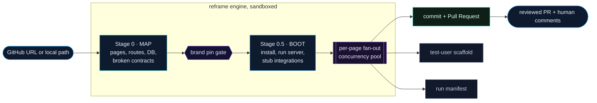
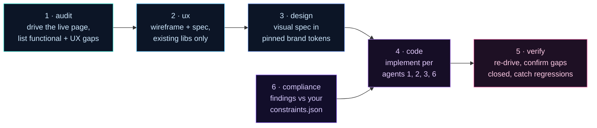

<!-- ░░░░░░░░░░░░░░░░░░░░░░░░░░░░░░░░░░░░░░░░░░░░░░░░░░░░░░░░░░░░░░░░░░░░ -->

<p align="center">
  
</p>

<p align="center">
  <strong>Point it at any GitHub URL or local repo.</strong><br>
  Reframe maps the codebase, boots it, and fans out a <strong>1-mapper + 6-agent</strong> pipeline across every screen in parallel —<br>
  then opens a clean Pull Request with <em>verified, human-reviewed</em> fixes. Not vibes. A diff you can merge.
</p>

<p align="center">
  
  
  
  
  
  
</p>

<p align="center">
  <a href="#quickstart"><b>Quickstart</b></a> ·
  <a href="#how-it-works">How it works</a> ·
  <a href="#the-model--1-mapper--6-agents">The 6 agents</a> ·
  <a href="#human-in-the-loop-the-clincher">Review gate</a> ·
  <a href="#swappable-llm-providers">Swap the model</a> ·
  <a href="#under-the-hood">Internals</a>
</p>

---

## TL;DR

You (or your AI agent) shipped an app fast. It mostly works. But which of the 32 screens actually render? Which buttons are dead? Which DB columns does the code reference that don't exist anymore? Where's the TCPA disclaimer that should be on the lead form?

**Reframe answers that — screen by screen — and hands you the fix as a Pull Request.**

```bash
npx --yes @resultkitchen/reframe rebuild https://github.com/you/your-app --apply-mode review
```

One command. It clones, maps, boots, audits every page with a real headless browser, designs the fix in *your* brand tokens, checks it against *your* compliance rules, writes the code, **re-drives the page to prove the fix worked**, and opens a PR. A page that silently redirects to login can't fake a green check.

---

## See it in 90 seconds

<p align="center">
  <a href="video/reframe.mp4">
    
  </a>
</p>

<p align="center"><sub>
  The launch video is a self-contained <a href="https://github.com/heygen-com/hyperframes"><b>Hyperframes</b></a> composition (write HTML, render video).<br>
  Narration generated with <a href="https://fish.audio">Fish Audio</a> s2-pro. Render the real MP4 in one command — no design tools, no After Effects:
</sub></p>

```bash
cd video && npx hyperframes render --output reframe.mp4
# → reframe.mp4 (1920×1080, ~50s) — then convert to assets/reframe.gif for this README
```

> Why Hyperframes? It's HeyGen's open-source, Apache-2.0 video framework that renders HTML on headless Chrome — so the demo lives in the repo as code, diffs in git, and any AI agent can edit it ("make the title 2× bigger, add a fade-out"). The composition is in [`video/`](video/).

---

## Why Reframe

AI coding agents are great at *generating* apps and terrible at *telling you the truth* about them. The result is the modern vibe-coding hangover:

| The problem | What Reframe does about it |
| --- | --- |
| "It compiles" ≠ "it works" | **Boots the app and drives every page** in a real browser. A page that won't load is a first-class result, not a crash. |
| Hollow green checks | **Honest page-health.** An auth-redirect or a Next.js error overlay can *never* report PASS. |
| Code that lies about the DB | **Broken-contract diffing** — orphaned tables, missing columns, dead paths, type drift, surfaced with `file:line`. |
| Off-brand AI redesigns | Agent 3 designs **only** in your pinned brand tokens. No invented colors. |
| Compliance landmines (TCPA / HIPAA / FTC) | A dedicated compliance agent checks every screen against *your* rules. |
| "Trust me, I fixed it" | Agent 5 **re-drives the page** and confirms each gap is closed — and flags regressions. |
| Non-devs can't review a diff | A **visual review app** where anyone leaves comments that get embedded in the PR. |

**The bet:** the scarce thing isn't generating code — it's *verifying* it. Reframe is a verification engine that happens to write code.

---

## Quickstart

> **Requires Node 20+.** `npm install` also pulls a Playwright Chromium it drives headlessly.

```bash
git clone https://github.com/resultkitchen/reframe.git
cd reframe
npm install
npm run build
```

Set whichever model key you want in `.env.local` — `GEMINI_API_KEY`, `ANTHROPIC_API_KEY`, or `OPENAI_API_KEY`.

### 1 — Initialize against your project

```bash
npm run reframe init ./my-app
```

Scaffolds three config templates so the AI codes against *your* product, not a generic one:

- `config/brand.json` — colors, type scale, spacing, voice (the design agent's only palette)
- `config/auth.json` — **test** logins per role, so gated pages get audited *logged in*
- `config/constraints.json` — your compliance/correctness rules

### 2 — Run a review pass (no code written yet)

```bash
npm run reframe rebuild ./my-app --apply-mode review --auth config/auth.json
```

Produces a `proposed-changes.md` + an `approvals.json` ledger. Open the visual review app:

```bash
npm run reframe review ./runs/my-app-<stamp>
```

### 3 — Apply only what you approved

```bash
npm run reframe rebuild ./my-app --resume runs/my-app-<stamp> --apply-mode pr
```

Reframe rewrites **only** the approved blocks, re-verifies, and opens a PR — with the entire human review conversation embedded in the PR description.

<details>
<summary><b>More CLI recipes</b></summary>

```bash
# Map a public repo and propose diffs only (no branch, no PR)
npm run reframe rebuild https://github.com/acme/todo-saas --apply-mode propose --concurrency 4

# Cost / speed controls: cap pages + route review agents to the cheap model tier
npm run reframe rebuild https://github.com/acme/todo-saas --max-pages 10 --quick-scan

# Drive dynamic routes with sample params so /leads/[id] is actually exercised
npm run reframe rebuild ./my-app --params '{ "id": "1", "slug": "demo" }'

# Point at a LIVE install: keep the real .env.local, skip destructive clicks
npm run reframe rebuild ./my-app --real-env   # implies --read-only

# Resume an interrupted run — completed page/agent checkpoints are skipped
npm run reframe rebuild ./my-app --resume runs/my-app-<stamp>
```

**Exit codes:** `0` = every processed page passed verification · `1` = a page failed or the run errored.
</details>

---

## How it works



1. **Map** the whole app — pages, routes, DB tables, data calls, component and library inventories — and diff code against schema to surface **broken contracts**.
2. **Boot** it in a provisioned, integration-stubbed environment. *"Won't start"* is a recorded outcome, not an exception.
3. **Fan out per page** through a parallel pool (default concurrency 8).
4. **Apply** on a per-run branch and open a PR (`pr`), or emit diffs only (`propose`), or stop at the review gate (`review`).
5. **Scaffold** a real test user per role with plain-English test scripts.
6. Write a **run manifest** — per-page pass/fail, wall-clock, and alerts.

---

## The model — 1 mapper + 6 agents

Every page gets its own crew. They run as a DAG, not a chat:



| Stage / Agent | Role | Output |
| --- | --- | --- |
| **Stage 0 — Map** | mapper | `ScopeDoc`: pages, DB tables, data calls, inventories, **broken contracts**, a bootstrapped brand candidate |
| **Stage 0.5 — Boot** | — | `BootResult`: installs deps, boots the dev server, stubs external integrations |
| **1 · Audit** | per page | Drives the live page, exercises it, returns a gap list (functional + UX) + honest health |
| **2 · UX** | per page | Wireframe + functional spec — constrained to libraries already in the repo |
| **3 · Design** | per page | Visual spec expressed **only** in pinned brand tokens |
| **6 · Compliance** | per page | Domain/legal findings vs the pinned `constraints.json` |
| **4 · Code** | per page | Implements the page per agents 1, 2, 3, 6 |
| **5 · Verify** | per page | Re-drives the page, confirms gaps closed, reports regressions |
| **Final — Scaffold** | — | Seeds a real test user per role + numbered manual test scripts |

---

## Human-in-the-loop (the clincher)

Reframe is built to keep the developer, designer, *and* a non-technical client in control.

- **`--apply-mode review`** runs only the read-only agents (audit / ux / design / compliance), writes **zero** code, and compiles a clean review dashboard.
- **Threaded comments** — anyone can review screen cards and type plain-English feedback (*"make the submit button royal-blue,"* *"this disclaimer is missing"*) and toggle **Approve** / **Skip** per fix.
- **Resume and apply** — on the apply pass, Reframe reads your decisions from `approvals.json`, rewrites **only** the approved blocks, re-verifies, and opens a PR with **the entire human conversation embedded in the PR description.**

```text
audit ─→ ux ─→ design ┐
                      ├─→ code ─→ verify
compliance ───────────┘
```

The review app is a React 19 + Vite SPA served by a zero-dependency Node server (`reframe review <run-dir>`), reading and writing the same `approvals.json` the engine consumes — so the hosted version and the local one share one contract.

---

## Swappable LLM providers

Pick your tradeoff. Set the provider with `--llm-provider` and pin model IDs in `config/models.json`.

| Provider | Sweet spot | Concurrency | ~30-screen app |
| --- | --- | --- | --- |
| **Gemini** *(default)* | fast, cheap, great general runs | `8+` | **10–15 min** |
| **Claude** | premium visual design + tricky coding | `2` *(rate limits)* | 40–60 min |
| **OpenAI** | drop-in interchangeable | tuned per tier | — |
| **OpenAI-compatible** | local models — Ollama, LM Studio | local | set base URL, e.g. `http://localhost:11434/v1` |

Non-Gemini providers are auto-capped to `concurrency: 2` with backoff so you don't get throttled.

---

## Under the hood

The parts that make it trustworthy instead of a toy:

- **Honest page-health (`PageHealth`).** Every drive is classified `ok` / `auth-redirect` / `error-overlay` / `http-error` / `navigation-failed`, captured from the *actual* navigation response. A page that isn't `ok` cannot pass — no hollow green checks.
- **Resumable by checkpoint.** A durable `RunState` ledger records per-page, per-agent status after every step. Crash, rate-limit, or `Ctrl-C`, then `--resume`: finished agents reload from disk, the rest continue.
- **Auth-aware auditing.** `--auth` form-fills your real login in the same browser context (real keystrokes via `pressSequentially`, not value-injection), so gated routes are audited as the logged-in user — not as a redirect to the landing page.
- **Live-backend safety.** `--real-env` keeps the target's real `.env.local`; `--read-only` makes the browser skip destructive clicks (delete / send / pay / submit). Point it at production-adjacent installs without firing mutations.
- **Broken-contract detection.** Code-vs-schema diffing catches `missing-table`, `missing-column`, `dead-path`, `type-drift`, and `orphaned-feature` with `file:line` and severity.
- **No-dependency concurrency pool.** N workers pull from a shared queue; one page throwing never aborts the pool. Scratch (clone + `node_modules` + dev server) is **always** torn down in a `finally`.
- **Windows-hardened.** Unique-per-run scratch and run paths plus atomic state writes with retry — learned the hard way from EPERM file-lock failures.

---

## Project layout

```text
config/    models.json · brand.template.json · constraints.template.json · auth.template.json
src/
  types.ts          single source of truth — every module and agent codes against this
  config.ts         env + flags + files -> PipelineConfig
  cli.ts            reframe rebuild | init | review
  orchestrator.ts   the DAG, the concurrency pool, resumability
  gemini.ts         swappable LLM client (Gemini / Claude / OpenAI / local)
  git.ts            clone · branch · commit · diff · PR
  browser.ts        Playwright PageDriver — open / health / exercise / loginAs
  auth.ts           auth-aware auditing (role -> route matching, real login)
  scratch.ts        scratch lifecycle + disk guard
  state.ts          durable RunState (the resume ledger)
  manifest.ts       RunManifest read/write + markdown render
  proposed-changes.ts   review-gate report + severity-weighted effort estimate
  sample-params.ts  dynamic-route ([id] / [slug] / [...rest]) resolution
  server.ts         zero-dep server for the React review app
  stages/           stage0-map · stage0_5-boot · init-scaffold · final-scaffold
  agents/           agent1..6
review-app/         React 19 + Vite visual review SPA
video/              Hyperframes launch composition (this README's demo)
runs/               run output dirs (gitignored)
```

---

## Roadmap

Local-first today, designed toward a hosted tier on Google Cloud (Cloud Run Jobs for the engine, Cloud Run for the review API, Firebase Hosting for the SPA, Cloud Storage + Firestore for artifacts and approvals). The `ReviewStore` interface already keeps a `GcsReviewStore` viable.

---

<p align="center">
  
</p>

<p align="center"><b>Ship a rebuilt app, not a guess.</b><br>
<sub>Pin the brand, pin the constraints, review with comments — and every re-run is reproducible.</sub></p>
