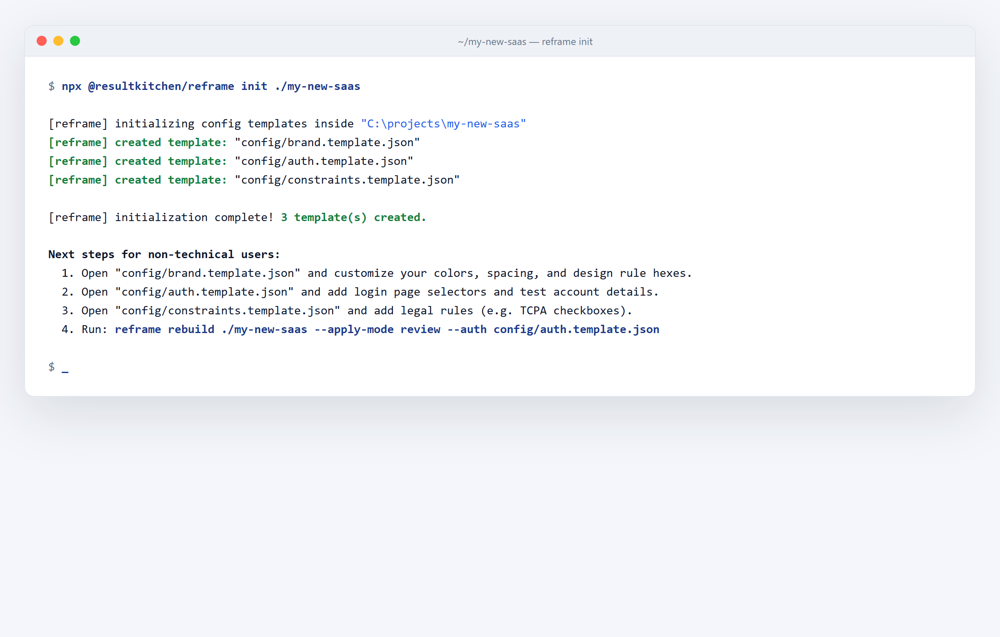
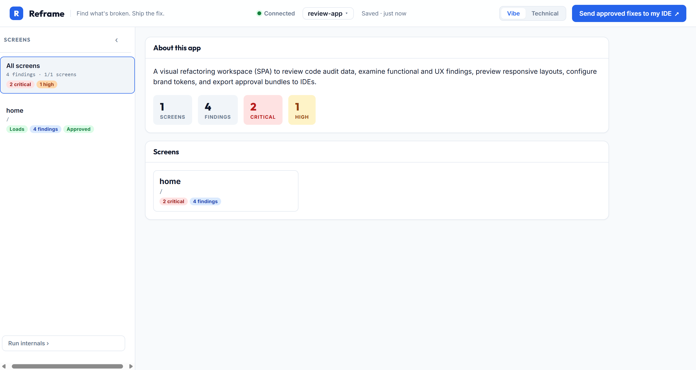
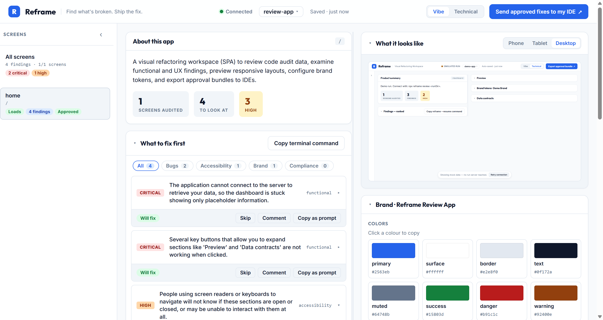
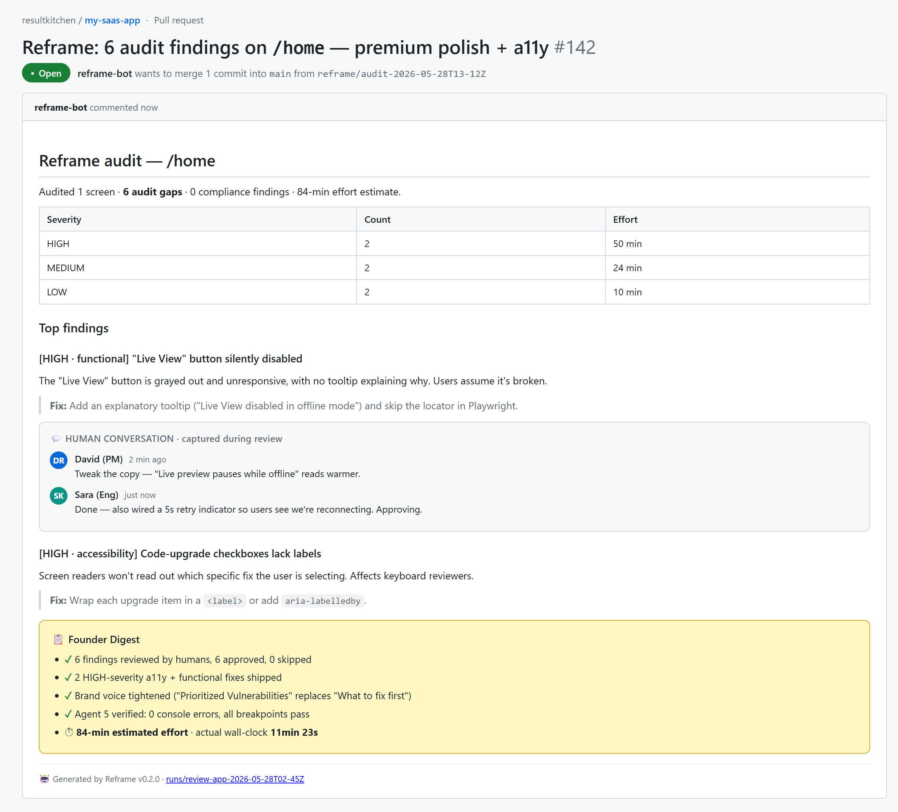

# Quickstart — the vibe-coder walkthrough

You vibe-coded an app. It mostly works. Now you need to know which screens function and which ones lie to you.

Three checkpoints. 20 minutes. A real PR at the end.

**Before you start:**
- Node 20+ (`node -v` to check)
- A repo or local app folder to audit
- One API key in `.env.local`: `GEMINI_API_KEY` (cheapest), `ANTHROPIC_API_KEY`, or `OPENAI_API_KEY`

---

## Minute 1 — install + run

```bash
npx --yes @resultkitchen/reframe init ./my-app
npx reframe rebuild ./my-app --apply-mode review --auth config/auth.json
```

<p align="center">
  
</p>

**What just happened:**
- `init` wrote three configs to `./my-app/config/`: `brand.json` (your colors + voice), `auth.json` (test logins), `constraints.json` (your compliance rules).
- `rebuild --apply-mode review` mapped your pages, booted your app in a sandbox, and started driving every screen at iPhone / iPad / desktop.

**What to do:** open `config/brand.json` and fill in real colors. Or skip — `reframe bootstrap ./my-app` will infer it from your Tailwind config.

**If it breaks:** Node version error → upgrade to 20+. No key found → `.env.local` lives in the project root, not the run dir.

---

## Minute 5 — review the findings

When the run finishes (10–15 min for ~30 screens on Gemini), it prints a command. Run it.

```bash
npx reframe review ./runs/my-app-<stamp>
```

<p align="center">
  
</p>

**What you're looking at:** the Run Overview. The 5-second answer — what the product is, how many screens, how many findings, what's HIGH. Sidebar lists every screen with status chips (Approved / Skipped / findings count).

**What to do:** click a screen. Findings on the left, preview + brand + data contracts on the right. Each finding is collapsed by default — click to expand.

<p align="center">
  
</p>

**The Vibe / Technical toggle in the top bar swaps every label and the finding text register atomically:**

- **Vibe:** "The Submit button doesn't actually do anything"
- **Technical:** `handleSubmit is not a function in intake.tsx:42`

Vibe is the founder voice. Technical is the engineer voice. One toggle, the whole SPA flips.

For each finding:
- **Approve** → Reframe will rewrite the code in the apply pass
- **Skip** → leave it alone
- **Comment** → "make the submit button royal-blue" — plain English, goes into the PR

Your non-technical client can do this from their laptop. No git knowledge required. Everything saves to `runs/my-app-<stamp>/approvals.json` in real time.

**If it breaks:** Empty overview → check `runs/.../scope.json` exists; if not, the mapper failed — see logs. No findings on a broken page → `PageHealth` likely says `auth-redirect`. Re-run with `--auth config/auth.json` and a real test login.

---

## Minute 20 — apply + get a real PR

```bash
npx reframe rebuild ./my-app --resume runs/my-app-<stamp> --apply-mode pr --post-findings
```

<p align="center">
  
</p>

**What just happened:**
1. The code agent rewrote ONLY the blocks you approved.
2. The verify agent re-drove every modified page in Chromium.
3. Any regression bumped the page back to a failure — no PR until the page actually passes.

**The PR body:** plain-English summary on top, per-finding technical breakdown below, your review comments embedded. With `--post-findings`, a separate PR conversation comment posts the top-3 findings ranked by impact — because GitHub sends notifications on comments, not body edits.

**Exit codes:** `0` = every processed page verified clean · `1` = a page failed or the run errored. Wire that into CI.

**If it breaks:** PR didn't open → check `gh auth status`. Empty PR body → `approvals.json` has no approved items. Verify failed on every page → the boot gate stubbed an integration the code now depends on. Re-run with `--real-env`.

---

## Common gotchas

A few things that will trip you up. We've eaten every one so you don't have to.

- **Windows EPERM mid-run.** Antivirus locking the scratch dir. Exclude `runs/` and `.reframe-scratch/` from real-time AV.
- **`--auth` doesn't carry through.** Login form has client-side validation that doesn't fire on `.fill()`. Reframe uses `pressSequentially` + `.blur()` — if your form still rejects, debug standalone with `scripts/test-login.mjs`.
- **Mapper over-scopes.** If Stage 0 reports >80 pages you'll see a warning. Point the CLI at the subdir (`./my-app/apps/web`), not the monorepo root.
- **Boot gate fails.** "Won't start" is a first-class result. Check `runs/.../boot.json` for the underlying error — usually a missing env var. Use `--real-env` to pass through.

---

## What's next

- **`reframe verify <runDir>`** — fix a finding by hand, re-run only Agent 5 in ~30 seconds.
- **CI gate.** `.github/workflows/reframe-pr-template.yml` is the drop-in PR audit Action. Set `GEMINI_API_KEY` as a repo secret. `--diff-only` keeps it tractable on big repos.
- **[ADRs](adr/)** — every architectural decision. Start with ADR-0001 for the signal-count primitives.
- **[Module API](MODULE-API.md)** — embed Reframe programmatically.
- **[Brand spec](BRAND_SPEC.md)** — the brand pin gate and static extraction story.

Ship a rebuilt app, not a guess.
