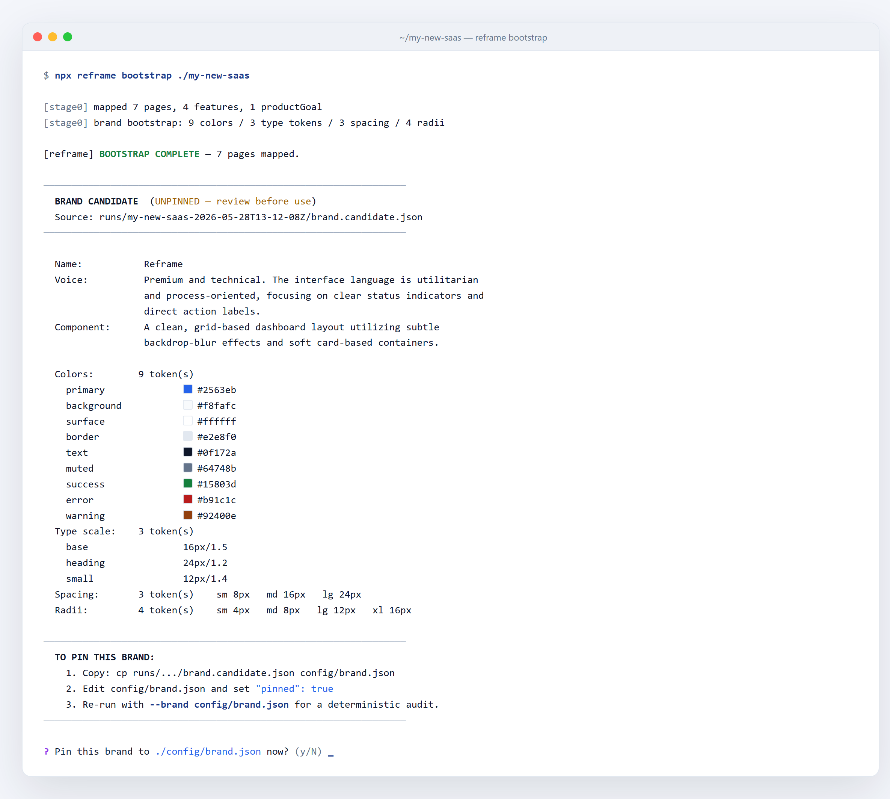
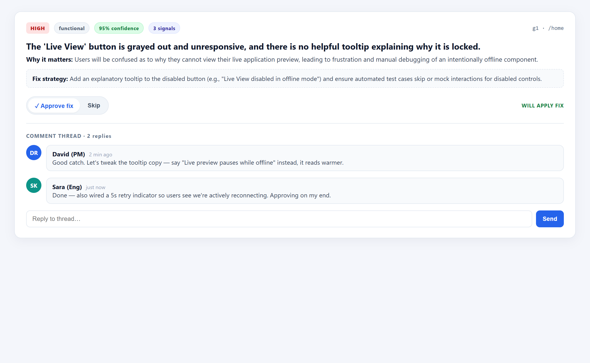

# Quickstart — the vibe-coder walkthrough

You vibe-coded an app. It mostly works. Now you need to know which screens actually function and which ones are lying to you.

This is the full Reframe loop, end to end, with screenshots. 7 steps. 20 minutes. A real PR at the end.

> No prior Reframe knowledge required. If you've ever run `npm install`, you're qualified.

**What you need before you start:**
- Node 20+ (`node -v` to check)
- A GitHub repo or a local app folder you want audited
- One API key: `GEMINI_API_KEY` (cheapest, fastest), `ANTHROPIC_API_KEY`, or `OPENAI_API_KEY`
- ~20 min of patience the first time. Future runs are faster — Reframe caches and resumes.

---

## ❶ Install + init

**What you're doing:** dropping Reframe into your project and creating three config files so it audits against *your* product, not a generic one.

```bash
npx --yes @resultkitchen/reframe init ./my-app
```

<p align="center">
  
</p>

**What you're looking at:** Reframe just wrote three templates into `./my-app/config/`:

- `brand.json` — your colors, fonts, voice. The design agent will refuse to invent colors outside this palette.
- `auth.json` — test logins per role, so gated pages get audited *logged in*, not as a redirect to the landing page.
- `constraints.json` — your compliance rules (TCPA disclaimers, HIPAA boundaries, FTC language, whatever you need).

Open each one, fill in real values. Or skip to step 2 and let Reframe bootstrap the brand for you.

**If it breaks:** "Node version" error → upgrade to Node 20+. "EACCES" on Linux/Mac → don't sudo, fix the npm prefix.

---

## ❷ Bootstrap your brand

**What you're doing:** letting Reframe read your codebase and propose a brand pin for you. Free first run. No agents. No PR.

```bash
npx reframe bootstrap ./my-app
```

<p align="center">
  
</p>

**What you're looking at:** Reframe statically extracted tokens from `tailwind.config.*`, CSS custom properties, your shadcn `components.json`, sampled real `<h1>` and `<button>` copy, then asked the LLM to **normalize** it — not parse it.

You'll see a summary inline: primary color, type scale, voice descriptors, sample copy. Then a prompt:

> Pin this to `config/brand.json`? [y/N]

Say yes. Every future run will use this pin and be fully deterministic. No more "the AI invented a new shade of teal."

**If it breaks:** "No tokens found" → your project has no Tailwind config, no CSS variables, no shadcn. Edit `config/brand.json` by hand. **If it hangs** → the mapper has a 300s timeout, but if your repo is 200+ pages it might still over-scope (we filter API routes, but check the warning at >80 pages).

---

## ❸ Run a review pass + open the SPA

**What you're doing:** running the audit. No code is written yet. Just findings.

```bash
npx reframe rebuild ./my-app --apply-mode review --auth config/auth.json
```

When it finishes (10–15 min for ~30 screens on Gemini), open the visual review app:

```bash
npx reframe review ./runs/my-app-<stamp>
```

<p align="center">
  
</p>

**What you're looking at:** the **Run Overview**. Every finding, across every page, ranked by severity × confidence. This is the screen that makes a 34-page audit reviewable in 10 minutes instead of an hour.

The sidebar lists every page Reframe audited. Each row has a status badge:
- ✓ Approved
- ⚪ Bypassed
- ⏳ Unreviewed

Click into a page to drill down, or stay on Overview and triage from the top.

**If it breaks:** Browser doesn't open → manually visit `http://localhost:5173`. Port in use → server reads `PORT` env. Empty overview → check `runs/my-app-<stamp>/scope.json` exists; if not, Stage 0 (map) failed — check logs for the timeout.

---

## ❹ Read a finding

**What you're doing:** looking at one finding and deciding if you trust it.

<p align="center">
  
</p>

**What you're looking at:** a finding card. Note the **dual-register**:

- **Plain:** "The Submit button doesn't actually do anything"
- **Technical:** `handleSubmit is not a function in intake.tsx:42`

The plain version is for the founder. The technical version is for the engineer. The toggle is one click. The PR description leads with plain by default.

The chips show:
- **Tier** — critical / high / medium / low
- **Dimension** — functional, brand-voice, accessibility, responsive, microcopy, compliance, data-contract, etc.
- **Confidence** — how sure the audit agent is
- **Signals** — what evidence triggered this (screenshot region, DOM selector, file ref)

Use the filter chips at the top to hide dimensions you don't care about. Crank the confidence slider to 0.7+ to kill noise.

**If it breaks:** No findings on a page that's obviously broken → check `PageHealth` on that page. If it's `auth-redirect`, your `--auth` didn't carry. Re-run with `--auth config/auth.json` and a real test login.

---

## ❺ Use the breakpoint strip

**What you're doing:** confirming the screen actually works on mobile, because your customer always sees it on their phone first.

<p align="center">
  
</p>

**What you're looking at:** the same page at iPhone 14 / iPad / Desktop, captured by the audit agent during the drive. Side by side. Plus a CSS-resize handle if you want to test a weird width.

This is where you catch the stuff your dev never sees on a 27" monitor — overflowing cards, hero text wrapping into 6 lines, sticky CTAs that cover the form.

**If it breaks:** Only one breakpoint visible → the audit didn't capture all three. Common cause: the page errored before all viewports finished. Check the page's `audit.json` in the run dir.

---

## ❻ Comment + approve/skip

**What you're doing:** telling Reframe what to actually fix.

<p align="center">
  
</p>

**What you're looking at:** the per-screen review UI. For every finding, you have:

- **Approve** — Reframe will rewrite the code in the apply pass
- **Skip** — leave it alone
- **Comment** — type plain English: *"make the submit button royal-blue"*, *"the disclaimer goes above the form, not below"*

All of it gets written to `runs/my-app-<stamp>/approvals.json` in real time. Your non-technical client can do this from their laptop. No git knowledge required.

After a few runs, Reframe surfaces **pattern insights**: *"You've skipped 14/17 low-severity a11y findings — want to hide that dimension by default?"* Computed locally. No telemetry leaves the box.

**If it breaks:** Approvals don't persist → the local server can't write to the run dir. Check disk space and folder permissions. On Windows, antivirus sometimes locks `approvals.json`; close the file and retry.

---

## ❼ Apply the approved fixes — open the PR

**What you're doing:** unleashing the code agent on *only* what you approved. Verifying. Opening a PR.

```bash
npx reframe rebuild ./my-app --resume runs/my-app-<stamp> --apply-mode pr --post-findings
```

<p align="center">
  
</p>

**What you're looking at:** a real GitHub Pull Request. The body leads with the plain-English summary (so a non-technical reviewer can read it), followed by the full per-finding breakdown, followed by the embedded human conversation from the review app.

With `--post-findings`, a separate **PR conversation comment** also goes up with the top-3 findings ranked by impact — because GitHub sends comment notifications, but **not** body-edit notifications. (Learned that one the hard way.)

What just happened under the hood:
1. The code agent rewrote *only* the approved blocks.
2. The verify agent re-drove every modified page in Chromium.
3. Any regression bumped the page back to a failure → no PR until the page actually passes.

**Exit codes:** `0` = every processed page verified clean · `1` = a page failed or the run errored. Wire that into CI.

**If it breaks:** PR didn't open → check `gh auth status` (Reframe uses your GitHub CLI auth). PR body is empty → check `approvals.json` actually has approved items. Verify failed on every page → likely the boot gate stubbed an integration the code now depends on; re-run with `--real-env`.

---

## Common gotchas

A few things that will trip you up. We've eaten every one of these so you don't have to.

- **Windows EPERM during run.** Antivirus locking the scratch dir mid-write. Reframe now uses unique-per-run scratch paths and atomic writes with retry — but if you're seeing it, exclude `runs/` and `.reframe-scratch/` from real-time AV scanning.
- **Scratch dir won't delete on `Ctrl-C`.** The scratch is always torn down in a `finally`, but a hard kill (`Ctrl-Break`, taskmgr) can leave it. Safe to delete `.reframe-scratch/<run>-<id>/` manually.
- **No API key set.** `.env.local` is read at startup. If you `export` it in the shell, that works too. If you see "no key found for provider gemini" — check the file is in the project root, not the run dir.
- **`--auth` doesn't carry through.** You set up a test user but every gated page returns `auth-redirect`. Common cause: the login form has client-side validation that doesn't fire on `.fill()`. Reframe uses `pressSequentially` keystrokes + `.blur()` to enable disabled submit buttons — if your form is still rejecting, run `scripts/test-login.mjs` against your app to debug standalone.
- **Mapper over-scopes on a monorepo.** If Stage 0 reports >80 pages you'll get a warning. API routes are already filtered, but if you're auditing one app in a monorepo, point the CLI at the subdir (`./my-app/apps/web`), not the root.
- **Boot gate fails.** "Won't start" is a first-class result, not an exception. Check `runs/.../boot.json` for the underlying error. The most common cause: missing env var the dev server wants at boot. Use `--real-env` to pass through.

---

## What's next

- **`reframe verify <runDir>`** — fix a finding by hand, re-run only Agent 5 in ~30 seconds. The tightest dev loop in the project.
- **CI gate.** `.github/workflows/reframe-pr-template.yml` is the drop-in PR audit Action. Put it in the repo you want audited, set `GEMINI_API_KEY` as a secret, every PR gets a top-3 finding comment. `--diff-only` keeps it tractable on big repos.
- **[ADRs](adr/)** — every architectural decision in this project, with rationale. Start with ADR-0001 if you want to understand the signal-count primitives.
- **[Module API](MODULE-API.md)** — embed Reframe programmatically. Useful if you're building a SaaS layer on top.
- **[Brand spec](BRAND_SPEC.md)** — the full story on the brand pin gate, static extraction, and the LLM normalization step.

Ship a rebuilt app, not a guess.
